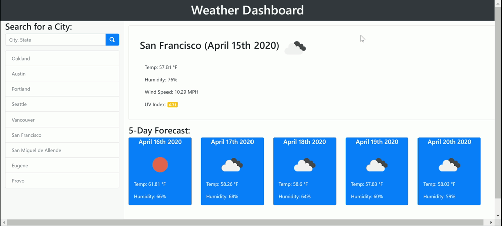

# Weather Dashboard Challenge

## Purpose
Create a dashboard that queries an API to show the current weather and five day forecast of the user's choice. When a city and state are searched, that city will be added to a list that will persist on refresh. Up to nine cities total will be stored at any one time, at which point the oldest city will be replaced on an subsequent searches. The user can click on a city in the list to go to that city's weather results.

Please search by typing the the full name of the city, a comma, and the full name of the state, like so: "Portland, Oregon".

## Website
The actual website can be viewed at the [following link](https://aelisker.github.io/weather-dashboard/). The code repository can be found at [here](https://github.com/aelisker/weather-dashboard/).

You can also find a screenshot of the website below:

